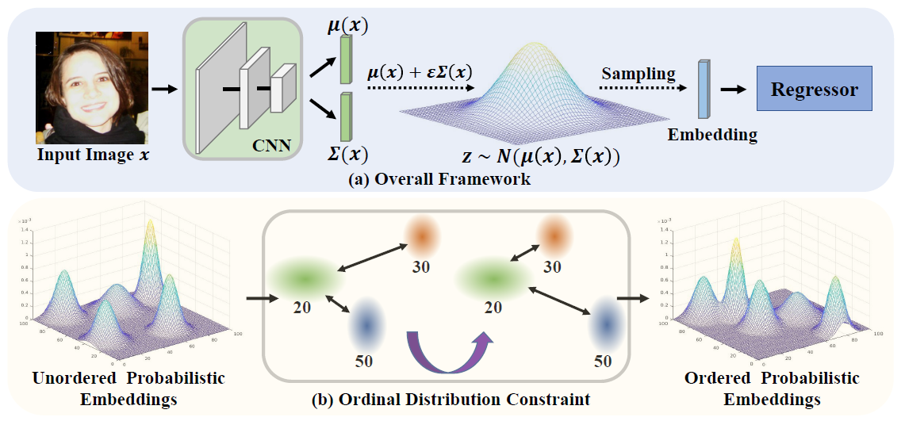

# POEs

[](https://paperswithcode.com/sota/age-estimation-on-adience-1?p=learning-probabilistic-ordinal-embeddings-for)
[](https://paperswithcode.com/sota/historical-color-image-dating-on-hci?p=learning-probabilistic-ordinal-embeddings-for)
[](https://paperswithcode.com/sota/aesthetics-quality-assessment-on-image?p=learning-probabilistic-ordinal-embeddings-for)


PyTorch implementation of Learning Probabilistic Ordinal Embeddings for Uncertainty-Aware Regression  (CVPR 2021) \[[arXiv](https://arxiv.org/abs/2103.13629)\]\[[Homepage](https://li-wanhua.github.io/POEs/)\]

<p align="center">
  
</p>

If you find our work useful in your research, please consider citing:
```
@inproceedings{li2021probabilistic,
  title={Learning Probabilistic Ordinal Embeddings for Uncertainty-Aware Regression},
  author={Li, Wanhua and Huang, Xiaoke and Lu, Jiwen and Feng, Jianjiang and Zhou, Jie},
  booktitle={Proceedings of the IEEE Conference on Computer Vision and Pattern Recognition (CVPR)},
  year={2021}
}
```

# Codes
[Adience](./codes/adience_poe)
